# Senzor za zaznavo gest z roko

## 1. Zahteve:

Ves projekt je bil narejen z naslednjimi zahtevami:

- Python version: 3.9.4  https://www.python.org/downloads/ (pip je že vključen)
- pip version: 21.1
- Node version: 15.12.0 https://nodejs.org/en/download/ (npm je že vključen)
- npm version: 7.6.3

## 2. Začetek in uporaba:

Ko imate vse zahteve izpolnjene, morate prvič, ko želite pognati program narediti naslednje:

1. Odprete ukazno vrstico (cmd.exe) in se v ukazni vrstici prestavite v mapo handpose.
2. Napišete komando `npm -i`.
3. Ko se inštalacija dokonča, program poženete s komando `npm run both`. Če dobite kakšne errorje, da manjka kak dependency, vpišite komando za inštaliranje manjkajočih dependencijev, ki vam jo vrne error in potem ponovno `npm run both`.
4. Ko je program pognan (v ukazni vrstici se vam izpiše `listening on port 3000`), odprete brskalnik (najbolje chrome) in grete na naslov: `http://localhost:3000`

Na spletni strani se vam prikaže okno na levi strani, kjer se izvaja detekcija roke. Lahko prikažete celotno kamero ali pa prikažete samo zaznavo roke. Na desni strani je testni video, katerega lahko upravljate z gesto rok (najprej kliknite play na video in potem, ga lahko manipulirate z roko). Program pa ne deluje samo na tem testnem videu. Program deluje nad kateri koli programom, ki ima izpolnjene zahteve za media keys. Na primer če obiščete `www.youtube.com` in izberete poljuben posnetek, bo detekcija gest delovala nad tem videom. Testirano je tudi na `YouTube Music Desktop App`, najverjeneje pa deluje tudi na aplikacijah kot so `Spotify`...

## 3. Geste:

Program podpira kar 7 gest rok. Geste so:

#### 1. Play 
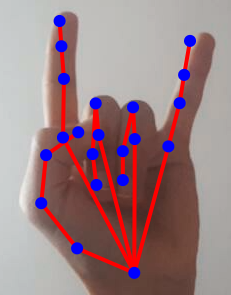 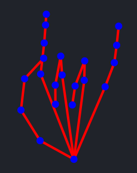

#### 2. Pause
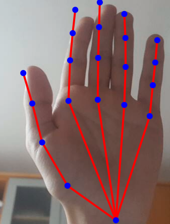 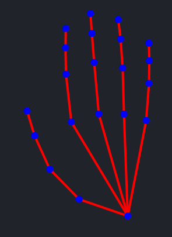

#### 3. Mute
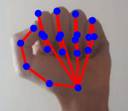 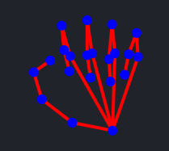

#### 4. VolumeUp
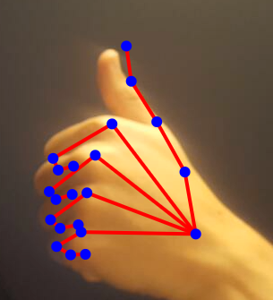 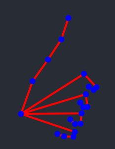

#### 5. VolumeDown 
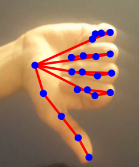 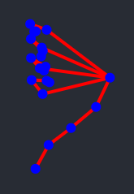

#### 6. Next*
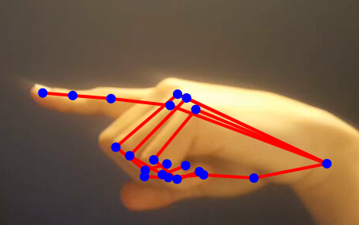 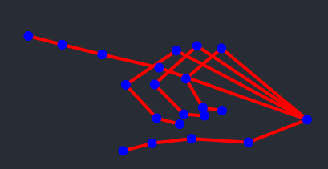

#### 7. Previous*
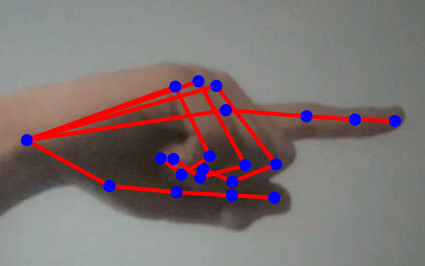 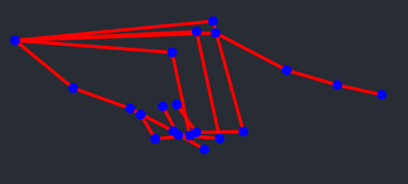

*Kamera na spletni strani ni zrcaljena, to pomeni da morate za gesto `Next` kazati z roko v desno in za `previous` v levo, vendar se na spletni strani prikaže obratno.

## 4. Želimo vam uspešno upravljanje medijev s hand gesturami!

## 5. Links:

FingerPose:
https://github.com/andypotato/fingerpose

TensorflowJS handpose:
https://github.com/tensorflow/tfjs-models/tree/master/handpose

